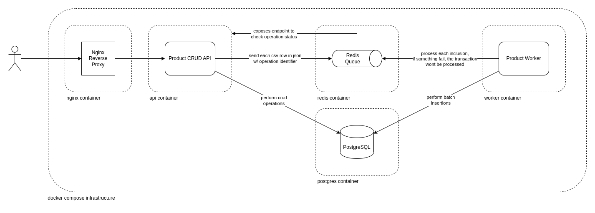

# Product CRUD

A simple CRUD (Create, Read, Update, Delete) application for managing products.

## Table of Contents

- Features
- Installation
- Usage
- API Endpoints
- Architectural Overview

## Features

- Create, Read, Update, and Delete products.
- Upload .csv files to perform bulk creations.

## Installation

### Prerequisites

- Docker.
- Docker Compose.

### Clone the Repository

```bash
git clone https://github.com/yourusername/product-crud.git
cd product-crud
```

### Configure Environment Variables

Remove the ".example" extension from all files in the "config/" folder and replace their content with your values.

### Build and Startup Services

```bash
docker compose -f docker/docker-compose.yml build
docker compose -f docker/docker-compose.yml up -d
```

Visit [http://localhost:3000](http://localhost:3000) to access the application.

## API Endpoints

- `GET /api/products`: Get all products.

    Query Parameters:
    - `page` (required, number): Defines search page, based on limit.
    - `limit` (required, number < 50): Defines the limit of returned products (limited to 50 products).
    - `keyword` (optional, string): Defines the keyword to be searched in products title.

- `GET /api/products/:code`: Get a specific product by code.
- `POST /api/products`: Create a new product.

    Body:
    - `code` (required, string): Defines product's unique code.
    - `title` (required, string): Defines product's title, used in searches.
    - `price` (required, number): Defines product's price.

- `PATCH /api/products/:code`: Update a product by code.

    Body:
    - `price` (required, number): Defines product's price.

- `POST /api/products/bulk`: Streams a .csv file to process bulk products.

    CSV Format (code, title, price):
    ```csv
    CP001,Engine Oil,25.99
    CP002,Brake Pads,35.75
    CP003,Air Filter,12.50
    CP004,Spark Plugs,8.25
    CP005,Transmission Fluid,18.99
    ```

- `GET /api/products/bulk/:taskId`: Checks the status of bulk processing task.

To more detailed endpoint specifications, download and import the [Postman Collection](docs/product-crud.postman_collection.json).

## Architectural Overview

Check the high-level architecture in the diagram bellow:

